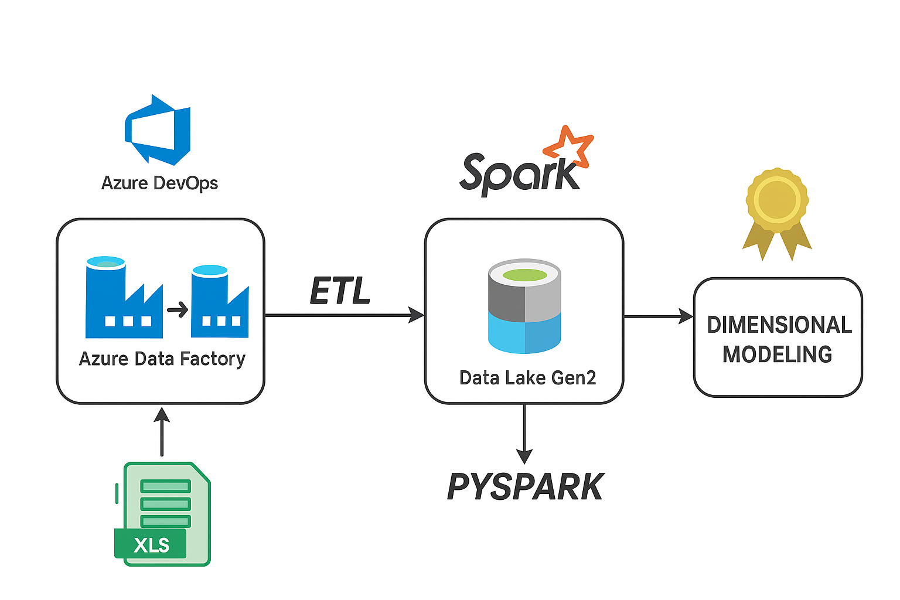
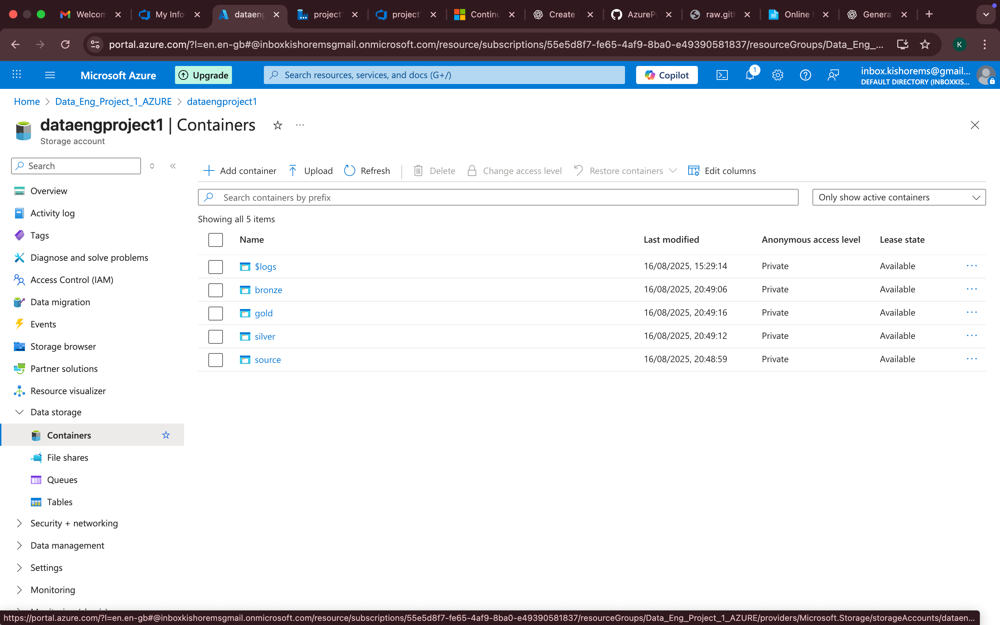
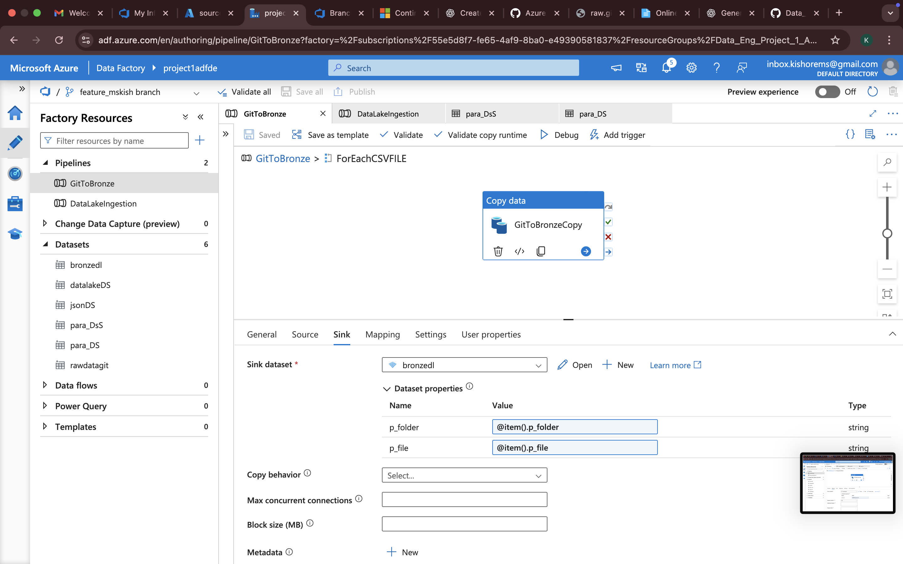
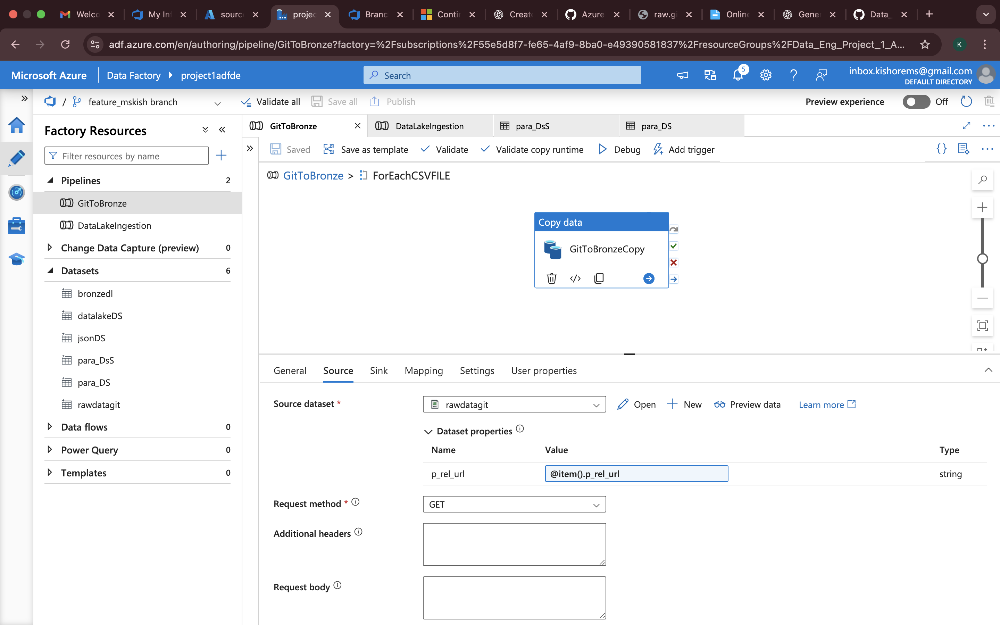
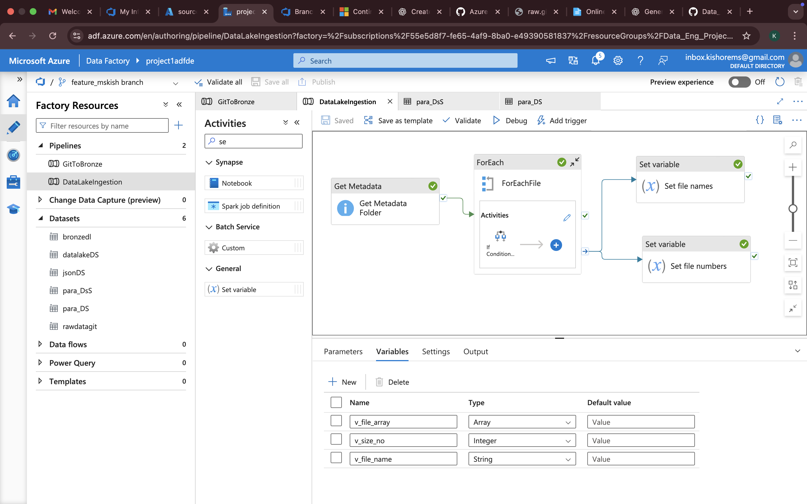
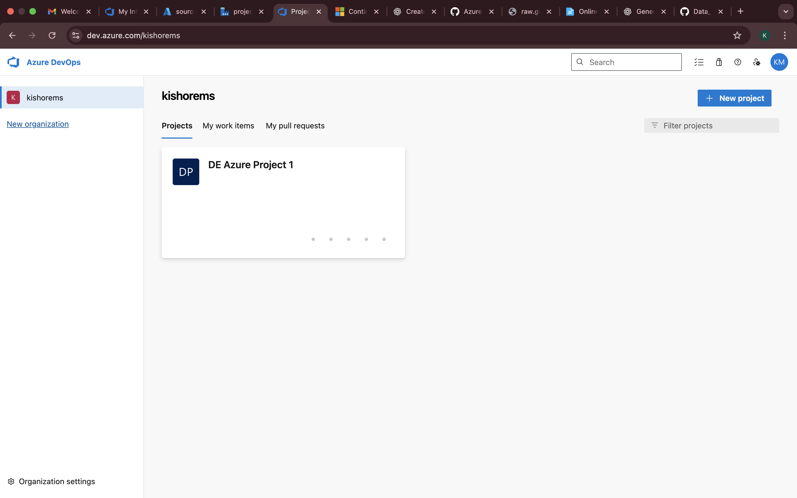
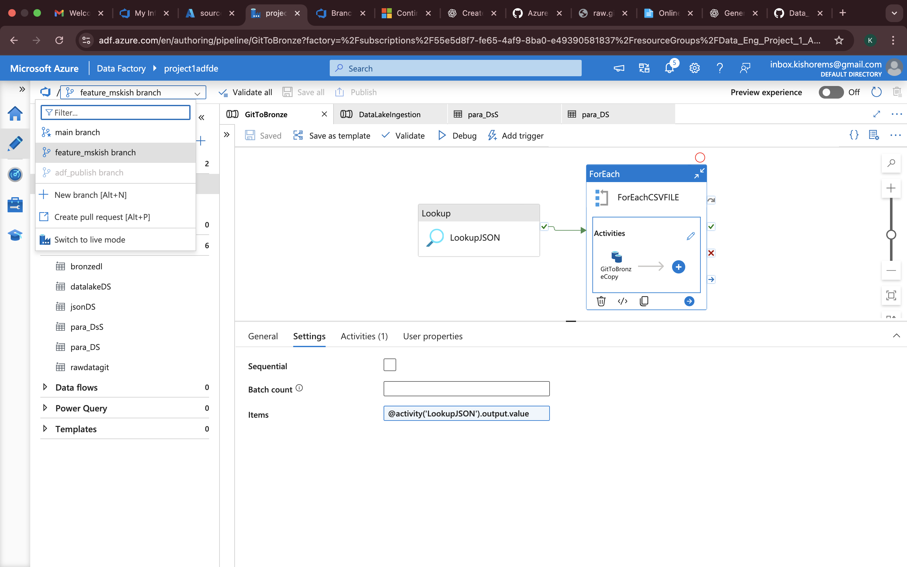

# 📘 Next-Gen Azure Data Engineering Pipeline: CI/CD-Driven Medallion Architecture with Unity Catalog, Dimensional Modeling, Governance & Dynamic Databricks Workflows

**End-to-End Data Pipeline designed and implemented by Kishore MS**  
🔗 LinkedIn: [Kishore MS](https://in.linkedin.com/in/kishore-m-s-ba56b4245)

(Paris Olympics 2024 Dataset)

---

## 🔹 Project Overview

This project demonstrates a real-world Data Engineering pipeline built on Azure Cloud, following the **Medallion Architecture** (Bronze → Silver → Gold).

It covers **data ingestion, transformation, dimensional modeling, governance, and CI/CD automation** using:

- **Azure Data Factory (ADF)**
- **Azure Data Lake Storage Gen2 (ADLS Gen2)**
- **Databricks (PySpark, Workflows, Unity Catalog)**
- **Azure DevOps (CI/CD pipelines, Git branching)**

---

## 📂 Dataset Source

**Dataset:** Paris 2024 Olympics Summer Games (Kaggle)  

**Files used:**
- `Athletes.csv` → Master dataset (36 attributes: age, gender, country, event participation, etc.).  
- `Coaches.csv` → Mapping between athletes and coaches.  
- `Events.csv` → Event metadata (event name, type, category, 200+ tags).  
- `NOCs.csv` → National Olympic Committees dataset with country/demographic details.  

---

## 🏗️ Architecture

- **Source Folder** → Raw CSVs uploaded into ADLS Gen2.  
- **Bronze Layer** → Ingested (CSV → Parquet).  
- **Silver Layer** → Cleaned & transformed entities.  
- **Gold Layer** → Curated dimensional model (Flat model since there is no facts table).  
- **Governance** → Unity Catalog with metastore + external locations.  
- **Automation** → Databricks Workflows orchestrated using JSON config + parameterized notebooks.  

---

## ⚙️ Tools & Services Used

- **Azure Data Factory (ADF)** → Data ingestion pipelines.  
- **Azure Data Lake Storage Gen2 (ADLS)** → Central data lake with Source, Bronze, Silver, Gold zones.  
- **Azure Databricks** → PySpark transformations, Delta Live Tables, Workflows.  
- **Unity Catalog (Databricks)** → Governance with metastore + external locations.  
- **Azure DevOps** → Git repo, feature branching, pull requests, CI/CD deployments.  
- **GitHub** → Project showcase repository + raw data source.  

---

## 🔄 Pipeline Workflow

### 1. Source Folder Setup (ADLS)
- Created a **`source/` folder** in ADLS Gen2.  
- Uploaded `Coaches.csv`, `Events.csv`, `NOCs.csv` into `source/`.  
- These will be ingested into Bronze via ADF.  

### 2. Azure DevOps Setup
- Created **Git repo** in Azure DevOps.  
- Worked in **feature branches**, merged into **main** with pull requests.  
- Integrated **ADF with DevOps** for JSON version control.  
- Set up **CI/CD pipelines** to deploy ADF pipelines automatically.  

### 3. Data Ingestion to Bronze Layer
There are **two ingestion paths** into the Bronze layer:

- **Athletes.csv from GitHub → Bronze**  
  - ADF `Copy Data` activity with an **HTTP linked service** pulls the raw CSV directly from GitHub.  
  - Landed into **Bronze folder** in ADLS and converted to Parquet.  

- **Coaches.csv, Events.csv, NOCs.csv from Source → Bronze**  
  - Uploaded to `source/` in ADLS.  
  - ADF `Lookup` + `Copy Data` pipelines move them into **Bronze folder**.  
  - Converted to Parquet for performance & cost optimization.  

### 4. Governance Setup (Unity Catalog)
- Created a **Metastore** in Databricks Unity Catalog.  
- Defined an **External Location** pointing to ADLS Gen2.  
- Configured **governance for read/write** across Bronze, Silver, Gold.  

### 5. Bronze → Silver (Transformations in Databricks)
- Connected **Databricks → ADLS Gen2** using DBUtils connector with storage account key.  
- Mounted ADLS paths.  
- **Transformations applied**:  
  - `Athletes.csv` → filtering, joins, aggregations, window functions, column derivations.  
  - `NOCs.csv` → standardization & enrichment (not just direct load).  
  - `Coaches.csv` & `Events.csv` → minimal processing, promoted to Silver.  

### 6. Silver → Gold (Curated Zone with Delta Live Tables)
- Used **Delta Live Tables (DLT)** for declarative ETL, schema enforcement, and quality checks.  
- Gold layer implemented as **Dimensional Model** (Flat Dimensions, no fact table needed):  
  - `dim_athletes`  
  - `dim_coaches`  
  - `dim_country`  
  - `dim_current`  
  - `dim_events`  
  - `dim_function`  
  - `dim_names`  
  - `dim_nationality`  
  - `dim_nocs`  

### 7. Databricks Workflows & Parameterized Notebooks
- Created **Databricks Workflows** for orchestration.  
- Defined a **JSON config file** describing dataset logic.  
- Workflows used `Lookup` & `ForEach` loops to process datasets dynamically.  
- Made **notebooks parameterized** using `dbutils.widgets`:  
  - Passed dataset/file path as parameter.  
  - Same notebook reused across multiple datasets.  

---

## 📌 Key Functions & Features

### 🔹 Azure Data Factory
- `Lookup` activity  
- `Copy Data` activity  
- Dynamic parameterization  
- DevOps integration  

### 🔹 PySpark (Databricks)
- `select`, `filter`, `groupBy`, `agg`, `withColumn`, `when`, `col`  
- **Window functions** (`rank`, `dense_rank`)  
- **Joins** (Athletes ↔ Events, NOCs, Coaches)  
- Cleansing + enrichment  

### 🔹 Databricks Advanced
- **Unity Catalog** (Metastore + External Location)  
- **Delta Live Tables** (Gold layer curated tables)  
- **Workflows** (Lookup + ForEach loop)  
- **JSON-driven orchestration**  
- **Dynamic notebooks** (`dbutils.widgets`)  

### 🔹 Azure DevOps
- Git branching strategy  
- Pull requests  
- CI/CD deployment pipelines  

---

## 📸 Screenshots

*Created medallion architecture containers in ADLS Gen2 and uploaded relevant files to the source container.*

*Copied data from Git to the Bronze folder using a parameterized copy activity function.*

*Copied data from source container to bronze using Azure Data Factory.*

*Created Azure Dev Ops.*

*Created braches in Azure Dev Ops.*

*Merged and published to main branch in Azure Data Factory.*

*Pipleline published in main branch.*

*Using Databricks workflows, data that requires no transformation is pushed from bronze to silver in a parameterized way.*

*Dynamically read data using the dbutils.widgets function in a parameterized way and performed transformations in the Silver layer.*

*Catalog and Schemas created*

*Performed flat-layer dimensional data modeling in the Gold layer and wrote the output to ADLS Gen2.*

> ⚠️ **Note:** Screenshots of Silver and Gold layer transformations are not included here, as the detailed steps are available in the attached **Databricks Notebooks** within the repository.
---

## 🎯 Key Takeaways
- End-to-end enterprise-grade **Azure Data Engineering pipeline**.  
- Governance & security via **Unity Catalog**.  
- Reusable, dynamic workflows with **JSON + dbutils**.  
- Dimensional modeling in **Gold layer** with curated dimension tables.  
- CI/CD automation using **Azure DevOps**.  
- Built on a **real dataset (Olympics)** for relevance.  

---

## 🧑‍💻 Recruiter Note  
This project showcases my ability to design and implement a **full-scale Azure Data Engineering pipeline** with best practices like **CI/CD automation, Unity Catalog governance, parameterized workflows, and dimensional modeling**. It highlights my expertise in **ADF, ADLS, Databricks, and Azure DevOps** while working on a **real-world dataset (Paris 2024 Olympics)** — demonstrating the exact skills needed for enterprise-grade data engineering roles.  

