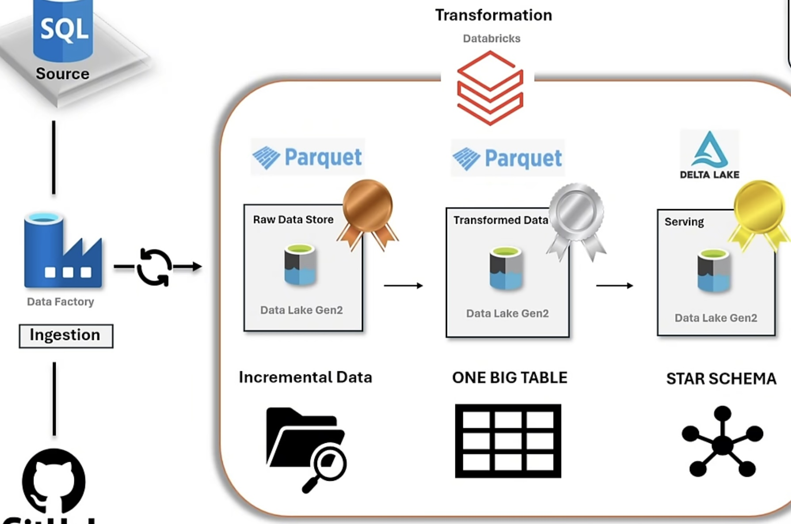

# 📘 Enterprise Data Engineering Pipeline on Azure: Building an Incremental Data Lakehouse with CDC, Watermarking, SCD and Star Schema Modeling

**End-to-End Data Pipeline designed and implemented by Kishore MS**  
🔗 LinkedIn: [Kishore MS](https://in.linkedin.com/in/kishore-m-s-ba56b4245)

(Sales Dataset – Car Sales Example)

---

## 🔹 Project Overview
This project simulates a **real-world enterprise Azure Data Engineering pipeline** with **incremental data loads, CDC, dimensional modeling, and SCD handling** integrating governance, orchestration, and reporting.  

---

## 📂 Dataset Source
- **Original Dataset** → Car Sales dataset (public).  
- **Prepared & Published** → Hosted in GitHub repository.  

---

## 🏗️ Architecture
- **Azure SQL Database** → Source system. Seeded with GitHub CSVs.  
- **Bronze Layer (ADLS Gen2)** → Raw incremental data landing.  
- **Silver Layer (ADLS + Databricks)** → Cleaned data
- **Gold Layer (Delta Tables)** → Star Schema (FactSales + Dimensions) Dimension separation, SCD handling. 
- **Governance** → Unity Catalog (Metastore, External Locations, Access Control).  

---

## ⚙️ Tools & Services Used
- Azure SQL Database  
- Azure Data Factory (ADF)  
- Azure Data Lake Storage Gen2  
- Azure Databricks (PySpark, Delta Lake)  
- Unity Catalog (Databricks)  
- Azure DevOps (CI/CD)  
- Power BI  
- GitHub  

---

## 🔄 Pipeline Workflow

### 1. Source System – Azure SQL Database
- Created an **Azure SQL Database**.  
- Defined **tables with schema upfront** (columns defined: IDs, sales date, branch, dealer, model, amount, etc.).  
- When data is copied from CSVs (via ADF), it directly lands into SQL tables **without errors**, since schema is already aligned.  
- This mimics how transactional systems usually work in enterprises (well-defined schemas, not schema-on-read).  

### 2. Initial Load
- Used **ADF Copy Activity** to load **full dataset** (Initial CSVs → SQL DB → Bronze in ADLS).  
- Stored in **Parquet** format.  
- Forms the baseline for further processing.  

### 3. Incremental Load (Change Data Capture)
- **ADF Lookup Activity** configured with **Last Load Date** and **Current Load Date**.  
  - Parameters: `@pipeline().parameters.LastLoadDate` and `@pipeline().parameters.CurrentLoadDate`.  
  - LastLoadDate → fetched from a **watermark table** in SQL DB.  
  - CurrentLoadDate → system date/time of current run.  
- This ensures that only **new rows after the last load** are processed.  

### 4. Watermark Table
- Created a dedicated **Watermark Table** in SQL DB.  
  - Columns: `TableName`, `LastLoadDate`.  
- **Purpose:**  
  - Tracks the last successful load for each table.  
  - Guarantees **idempotency** (no duplicate loads).  
- **Result:** When new incremental data arrives, ADF reads the watermark, loads only deltas, then updates watermark with the latest timestamp.  

### 5. Stored Procedures
- **In SQL DB:**  
  - A Stored Procedure created to **update the watermark table** after each successful pipeline run.  
  - Example: `EXEC usp_UpdateWatermark @TableName, @LastLoadDate`.  

- **In ADF:**  
  - Another Stored Procedure activity to call the above procedure.  
  - Ensures the pipeline’s **transactional consistency** (load + update watermark in one workflow).  

### 6. Bronze → Silver (Databricks Transformations)
- Used **Azure Databricks Access Connector** for secure ADLS access.  
- Data mounted into Databricks workspace.  
- Transformations applied:  
  - Split large sales table into **Fact + Dimensions**.  
  - Columns cleaned, standardized.  
  - **SCD Type 1 Handling:**  
    - Used `monotonically_increasing_id()` to generate **Surrogate Keys**.  
    - Upsert logic applied (new values overwrite old ones for the same business key).  

### 7. Silver → Gold
- Gold layer structured into **Star Schema**:  
  - `fact_sales`  
  - `dim_branch`  
  - `dim_dealer`  
  - `dim_model`  
  - `dim_date`  
- Stored as **Delta Tables** with ACID properties, schema enforcement, and version history.  

### 8. Governance with Unity Catalog
- Created a **Metastore** in Unity Catalog.  
- Defined **External Location** pointing to ADLS Gen2.  
- Configured access policies (RBAC) for different layers.  
- Tracked **lineage** and maintained **data quality checks**.  

---

## 📌 Key Functions & Features

### 🔹 Azure Data Factory
- Lookup Activity → pulls last & current load dates.  
- Stored Procedure Activity → updates watermark table post-load.  
- Parameterized pipelines for flexible reuse.  
- Incremental CDC implementation.  

### 🔹 Databricks (PySpark)
- Surrogate keys → `monotonically_increasing_id()`.  
- SCD Type 1 handling with **merge/upsert** logic.  
- Fact/Dimension separation from single source table.  
- Delta Lake for ACID + time travel.  

### 🔹 Governance (Unity Catalog)
- Metastore for all objects.  
- External Location to map ADLS paths.  
- RBAC + lineage + quality.  
---
## 📸 Screenshots

**Created medallion architecture containers in ADLS Gen2 and uploaded relevant files to the source container.*

*Copying Data from Git in a Parameterized Way Using Azure Data Factory.*

*Mapping the schema of the data from GitHub to the table we already created in Azure SQL DB using Data Factory so that when data is copied from CSVs (via ADF), it directly lands into SQL tables without errors, since schema is already aligned*

*Data mapped successfully and previewed in Data Factory.*

*Data copied to Bronze layer successfully.*

*Data reflected in Azure SQL DB.*

*Creating a watermark table.*

*Watermark table giving the max value of the last load*

*Creating a Stored Procedure on the Watermark Table.*

*Stored procedure, watermark table, and data reflected in Azure SQL DB.*

*Creating last load and current load lookup activity in Data Factory so that only new rows after the last load are processed.*

*After data is transformed in the Silver layer, creating a surrogate key called "dim_model_key" at the Gold layer level and parameterizing it using the Incremental Flag.*

*Catalog and Schema in Databricks*

*Star Schema Data Modeling with Fact and Dimension Tables on Gold Layer.*

> ⚠️ **Note:** Screenshots of Silver and Gold layer transformations are not included here, as the detailed steps are available in the attached **Databricks Notebooks** within the repository.

---
## 🎯 Key Takeaways
- Simulates **true enterprise setup** with SQL source, incremental loads, watermark tracking, and SCD.  
- **Watermark Table + Stored Procedures** make pipeline robust and incremental.  
- **Databricks Access Connector** ensures secure ADLS access.  
- **Surrogate Key with monotonically_increasing_id()** provides unique row identifiers for SCD.  
- End-to-end **Star Schema** built in Gold for reporting.  
- CI/CD with DevOps ensures production-readiness.  

---

## 🧑‍💻 Recruiter Note
This project demonstrates my **hands-on expertise in Azure Data Engineering**: CDC, watermarking, SCD, surrogate keys, dimensional modeling, governance and DevOps, integration. It reflects how real enterprise pipelines are designed and maintained.  